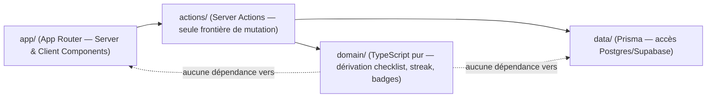
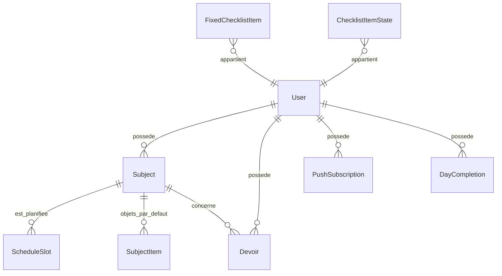

# Architecture Spine — CartableFlow

## Design Paradigm

Couches strictes avec un **noyau de domaine isolé du framework** :



`domain/` ne dépend ni de Next.js ni de Prisma : il reçoit des données déjà chargées et retourne des vues calculées ou des décisions (ex. "ce jour est-il complet ?"). C'est le seul endroit où vivent les règles de dérivation (AD-2, AD-3, AD-5) — un composant React ou une Server Action ne réimplémente jamais ces règles.

## Invariants & Rules

### AD-1 — Frontière de mutation unique

- **Binds:** toutes les FR impliquant une écriture (FR-1, FR-4, FR-5, FR-6, FR-8, FR-16, FR-17)
- **Prevents:** une validation ou une règle métier dupliquée (et divergente) entre un appel direct au client Prisma et une API REST parallèle.
- **Rule:** toute mutation passe par une Server Action dans `actions/`. Aucun accès Prisma direct depuis un Client Component, aucune route API REST parallèle pour les mêmes opérations.

### AD-2 — Sac et Révisions sont des vues dérivées, jamais stockées

- **Binds:** FR-3, FR-19
- **Prevents:** une checklist "sac" ou "révisions" stockée comme copie qui se désynchronise silencieusement de l'EDT réel.
- **Rule:** le contenu des blocs Sac et Révisions est calculé à la lecture à partir de `ScheduleSlot` + `Subject` + `SubjectItem` + `Devoir` du jour concerné. Aucune table ne persiste "la checklist du 14/10" comme liste générée.

### AD-3 — L'état coché se clé par identité stable, jamais par libellé

- **Binds:** FR-3, FR-5, FR-19
- **Prevents:** la perte de l'état coché quand un libellé est édité, ou une checklist qui reste "vide" après une correction d'EDT.
- **Rule:** `ChecklistItemState` est clé par `(date, checklistType, sourceType, sourceId)` — jamais par le texte affiché. Le recalcul en direct (PRD FR-3) rejoue cette clé contre les données courantes : un item encore présent garde son état, un nouvel item apparaît décoché, un item disparu du calcul n'est simplement plus rendu (pas de purge active requise).

### AD-4 — Le jour scolaire se calcule côté serveur, fuseau fixe

- **Binds:** FR-2, FR-3, FR-19, FR-13
- **Prevents:** une bascule "aujourd'hui/demain" incohérente entre deux appareils, ou près de minuit.
- **Rule:** toute notion de jour scolaire, "demain", ou limite de moment (soir/matin/retour) se calcule côté serveur dans le fuseau `America/Guadeloupe` (corrigé après la Story 1.4 -- codé `Europe/Paris` à tort avant, erroné pour une famille basée en Guadeloupe), jamais depuis l'heure locale du client.

### AD-5 — Le Streak se dérive, les Badges sont une fonction pure

- **Binds:** FR-13, FR-14
- **Prevents:** un compteur de streak qui se désynchronise (double incrément, race condition entre deux coches rapides) ou une table d'unlock de badges qui diverge du streak réel.
- **Rule:** `DayCompletion` enregistre, par jour scolaire, si chaque moment (soir en 3 blocs, matin, retour) est complet. Le Streak courant/meilleur se calcule en remontant cette table — ce n'est jamais un compteur incrémenté directement par une action client. Un Badge est débloqué si `bestStreak >= palier` : aucune table séparée d'unlock.

### AD-6 — La couleur de matière est assignée une fois, immuable

- **Binds:** DESIGN.md (subject-tag)
- **Prevents:** un décalage de couleur pour les matières existantes quand une matière est supprimée.
- **Rule:** l'index de couleur d'une `Subject` est écrit à sa création et ne se recalcule jamais depuis l'ordre courant de la liste.

### AD-7 — Un Devoir ne suit pas le cycle de réinitialisation quotidien

- **Binds:** FR-16, FR-17
- **Prevents:** un job de nettoyage nocturne qui supprimerait par erreur des devoirs non terminés.
- **Rule:** `Devoir.done` ne change que par action explicite de l'enfant. Contrairement à `ChecklistItemState`, aucune tâche planifiée ne réinitialise ou ne purge un Devoir.

### AD-8 — Les notifications sont programmées côté serveur ; le repli visuel est indépendant de la livraison push

- **Binds:** FR-10, FR-11
- **Prevents:** un rappel qui ne se déclenche jamais parce que l'app était fermée (timer client), ou un repli visuel qui reste silencieux parce qu'on suppose à tort que le push est arrivé.
- **Rule:** 3 Vercel Cron Jobs distincts (un par moment) invoquent une route serveur qui envoie les push Web Push aux abonnements enregistrés. Le bandeau de repli visuel (FR-11) se calcule à chaque ouverture/premier plan de l'app à partir de l'état réel des items en attente — jamais à partir d'un accusé de réception push (qu'aucune plateforme ne garantit de façon fiable).

## Consistency Conventions

| Concern | Convention |
| --- | --- |
| Naming (entités, fichiers) | Identifiants de code en anglais (`Subject`, `Homework`, `ChecklistItemState`, `DayCompletion`) même si le domaine produit est en français ; les libellés affichés restent en français (EXPERIENCE.md). |
| Dates & jour scolaire | Dates stockées en UTC ; toute logique de "jour scolaire" resolue côté serveur en `America/Guadeloupe` (AD-4), jamais côté client. |
| Multi-tenance | Toute entité est scopée par `userId` dès v1, même si un seul utilisateur existe réellement — évite une migration structurelle quand la Vue Parent ou le multi-enfant arriveront. |
| Mutation | Server Actions uniquement (AD-1) ; chaque action rappelle une fonction `domain/` pure pour toute règle de dérivation avant d'écrire via `data/`. |
| Erreurs | Les Server Actions retournent un résultat typé `{ ok: true, data } \| { ok: false, error }` — pas d'exception non gérée remontée jusqu'à l'UI. |
| Complétude / célébration | L'UI ne réimplémente jamais "ce moment est-il complet ?" : elle affiche l'état (et déclenche l'animation de célébration) à partir de la réponse de la Server Action après une coche, jamais d'un calcul local indépendant qui pourrait diverger de `DayCompletion` (AD-5). |

## Stack

| Name | Version |
| --- | --- |
| Next.js (App Router) | 16 (LTS) |
| React | 19.2 (bundlé par Next 16) |
| TypeScript | ^5.7 |
| Tailwind CSS | 4.3 |
| shadcn/ui | dernière CLI (compatible Tailwind v4 / Next 16 / React 19 confirmé) |
| Motion (ex-Framer Motion) | ^13.2 — package `motion`, `framer-motion` est un alias déprécié à ne pas installer pour un nouveau projet |
| Prisma ORM | 7.8 (stable — Prisma 8 encore en RC, non retenu) |
| Base de données | PostgreSQL via Supabase — **obligatoire en production** (voir AD ci-dessous) |
| Serwist (`@serwist/next`) | dernière version — remplace `next-pwa`, non maintenu |
| `web-push` (npm) | dernière version — envoi des notifications Web Push signées VAPID depuis les Server Actions/routes Cron |
| Hébergement | Vercel (Hobby) |

### AD-9 — Supabase Postgres est obligatoire, pas une alternative à SQLite

- **Binds:** toute la persistance
- **Prevents:** un déploiement de production sur SQLite qui perd des écritures — le système de fichiers de Vercel serverless est éphémère entre invocations.
- **Rule:** SQLite (provider Prisma alternatif) n'est utilisable qu'en développement local. Tout environnement déployé (il n'y en a qu'un, la prod) utilise Supabase Postgres. `[ADOPTED — corrige l'addendum du brief qui présentait les deux comme interchangeables]`

**Point de vigilance non bloquant, à connaître avant d'implémenter les notifications (FR-10) :** sur le plan Vercel Hobby (gratuit), chaque Cron Job ne peut s'exécuter qu'une fois par jour, avec une précision garantie seulement à ±59 minutes — pas à la minute près. Les 3 rappels quotidiens restent faisables (3 jobs distincts, jusqu'à 100 autorisés par projet), mais l'heure exacte que l'enfant configurera ne sera pas respectée au plus près. `[NOTE FOR PM: si cette imprécision gêne à l'usage réel, la seule solution est un upgrade Vercel Pro — pas un problème d'architecture applicative.]`

## Structural Seed

```text
college-6eme-app/
  app/                    # App Router : routes, layouts, Server + Client Components
    (accueil)/            # Écran Accueil (moment contextuel)
    edt/                  # Emploi du temps
    progression/          # Streak, badges
    reglages/             # Personnalisation objets/checklists
    api/cron/[moment]/    # Routes invoquées par les Vercel Cron Jobs
  actions/                # Server Actions — seule frontière de mutation (AD-1)
  domain/                 # TypeScript pur — dérivation checklist/streak/badges (AD-2, AD-3, AD-5)
  data/                   # Prisma client + fonctions de requête
  prisma/
    schema.prisma
  public/
    sw.js                 # Généré par Serwist
  vercel.json             # Déclaration des 3 Cron Jobs
```



- **User** — identifiant simple (v1 mono-utilisateur, voir Deferred).
- **Subject** — une matière ; porte l'index de couleur assigné à la création (AD-6).
- **ScheduleSlot** — un créneau EDT hebdomadaire (jour, horaire, `Subject`).
- **SubjectItem** — objet par défaut associé à une matière, personnalisable (FR-4).
- **FixedChecklistItem** — item fixe des checklists Matin/Retour, personnalisable (FR-6, FR-8).
- **Devoir** — matière, description, `aRendre`, `echeance` optionnelle, `done` (AD-7).
- **ChecklistItemState** — état coché keyé `(date, checklistType, sourceType, sourceId)` (AD-3).
- **DayCompletion** — un jour scolaire, complétude par moment ; base du calcul du Streak (AD-5).
- **PushSubscription** — abonnement Web Push par appareil.

## Capability → Architecture Map

| Capability / Area (PRD) | Lives in | Governed by |
| --- | --- | --- |
| §4.1 Emploi du temps (FR-1, FR-2) | `actions/schedule.ts`, `app/edt/` | AD-1, AD-4 |
| §4.2 Checklist Sac du Soir (FR-3 à FR-5) | `domain/checklist.ts`, `app/(accueil)/` | AD-2, AD-3, AD-6 |
| §4.3 Devoirs et Révision du Jour (FR-16 à FR-20) | `domain/homework.ts`, `domain/revision.ts`, `actions/homework.ts` | AD-1, AD-2, AD-3, AD-7 |
| §4.4-4.5 Checklists Matin/Retour (FR-6 à FR-9) | `domain/checklist.ts` (partagé avec Sac) | AD-2, AD-3 |
| §4.6 Notifications (FR-10 à FR-12) | `app/api/cron/[moment]/`, `vercel.json` | AD-8 |
| §4.7 Motivation (FR-13 à FR-15) | `domain/streak.ts`, `app/progression/` | AD-5 |

## Deferred

- **Vue Parent complète** — le scoping par `userId` (Consistency Conventions) prépare le terrain sans l'exposer.
- **Intégration Pronote (pawnote)** — phase 2 explicite ; aucune contrainte d'architecture prise dessus maintenant. À revérifier (maintenance de la lib) au moment de l'implémenter.
- **Multi-enfant / multi-profils** — pas de conception au-delà du scoping `userId` déjà en place.
- **Calendrier scolaire officiel automatisé** — v1 reste sur un marquage manuel "jour sans cours".
- **Alternance de semaines A/B pour l'EDT** — PRD question ouverte non tranchée ; `ScheduleSlot` part sur une semaine fixe. Si l'alternance existe réellement, ajouter un champ `weekParity` reste un changement localisé, pas une refonte.
- **Environnement de staging / CI** — projet personnel à un seul environnement de production ; pas de pipeline dédié en v1.
- **Suite de tests automatisés détaillée** — stratégie précise laissée au stade développement (`bmad-build`), pas fixée ici.
- **Internationalisation** — français uniquement, fixé, pas de couche i18n.
